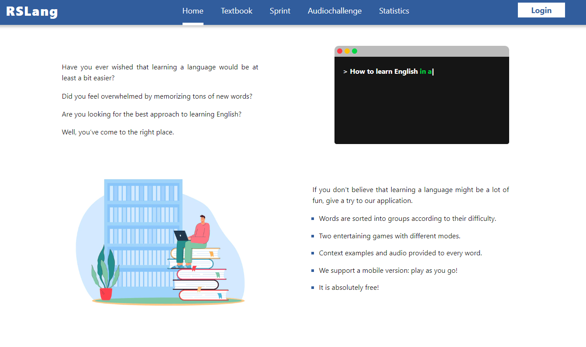

# English Learning App

A graduation project for [RS School](https://rs.school/). A web application for learning English created by the team of 3 developers. I designed and implemented from scratch Main Page and Textbook Page.

## What is it for?

You can learn and repeat words on the Textbook Page or play minigames for memorizing words. Authorized users can also track their progress.

[Check it out!](https://rslang-v-yelina.netlify.app/)

---

## Technologies:

- React
- Typescript
- Redux Toolkit
- React-router
- Ant Design
- SASS
- Eslint
- Prettier

---

## To run locally:

1. Clone repository:  
   `git clone https://github.com/nina-si/react-english-learning.git`
2. Move to folder:  
   `cd react-english-learning`
3. Install dependencies:  
   `npm install`
4. Run application:  
   `npm start`

Open [http://localhost:3000](http://localhost:3000) to view it in the browser.
